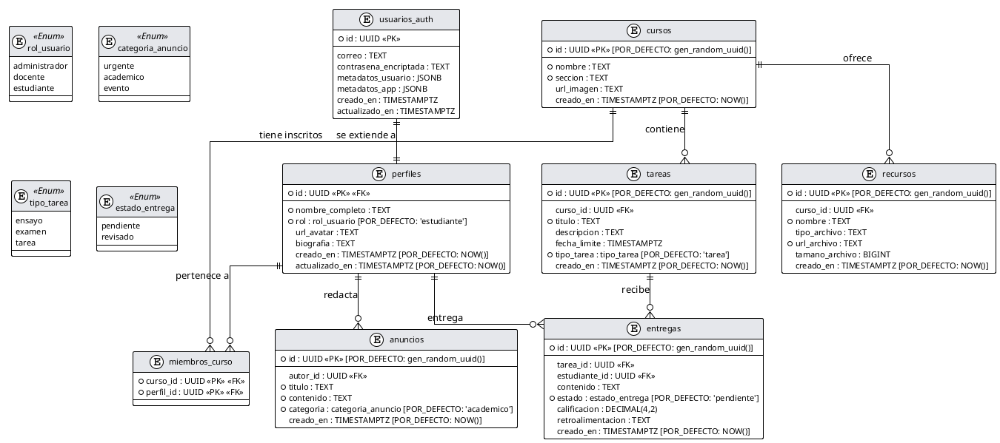

# 📊 Modelo Relacional de la Base de Datos - Infotarea

Este documento describe de manera exhaustiva el modelo relacional de la base de datos de **Infotarea**, una plataforma modular de gestión de tareas y comunicación escolar desarrollada con Next.js y Supabase.

El diseño sigue las mejores prácticas de integridad referencial, tipado estricto mediante enumeraciones (`ENUM`) y extensión segura del esquema de autenticación nativo de Supabase (`usuarios_auth`).

---

## 📐 Diagrama en PlantUML

Puedes copiar el código siguiente para renderizar el diagrama en cualquier editor compatible con **PlantUML** (como VS Code con extensión PlantUML, o el servidor oficial [PlantUML Online](https://www.plantuml.com/plantuml/)):

---

## 🗂️ Detalle de Entidades y Campos

### 1. `perfiles`
Esta tabla extiende el esquema de autenticación nativo de Supabase (`usuarios_auth`) almacenando la información pública y el rol específico de cada usuario.
*   **`id`** (`UUID`, Llave Primaria): Hace referencia a `usuarios_auth(id)` con eliminación en cascada.
*   **`nombre_completo`** (`TEXT`, Obligatorio): Nombre completo del usuario.
*   **`rol`** (`rol_usuario`, Obligatorio, Por defecto `'estudiante'`): Rol dentro del sistema (`administrador`, `docente` o `estudiante`).
*   **`url_avatar`** (`TEXT`, Opcional): Enlace a la imagen de perfil.
*   **`biografia`** (`TEXT`, Opcional): Breve biografía del usuario.
*   **`creado_en` / `actualizado_en`** (`TIMESTAMPTZ`, Por defecto `NOW()`): Registros de auditoría de tiempo.

### 2. `cursos`
Representa las asignaturas o aulas virtuales.
*   **`id`** (`UUID`, Llave Primaria): Identificador único autogenerado.
*   **`nombre`** (`TEXT`, Obligatorio): Nombre de la materia (ej. "Física Cuántica").
*   **`seccion`** (`TEXT`, Obligatorio): Sección o grupo (ej. "Grupo B").
*   **`url_imagen`** (`TEXT`, Opcional): Imagen representativa del curso.
*   **`creado_en`** (`TIMESTAMPTZ`, Por defecto `NOW()`): Fecha de creación.

### 3. `miembros_curso`
Tabla asociativa para gestionar la relación muchos-a-muchos ($N:M$) entre perfiles y cursos.
*   **`curso_id`** (`UUID`, Llave Primaria / Foránea): Referencia a `cursos(id)` con eliminación en cascada.
*   **`perfil_id`** (`UUID`, Llave Primaria / Foránea): Referencia a `perfiles(id)` con eliminación en cascada.

### 4. `tareas`
Tareas asignadas dentro de un curso en particular.
*   **`id`** (`UUID`, Llave Primaria): Identificador único autogenerado.
*   **`curso_id`** (`UUID`, Llave Foránea): Referencia a `cursos(id)` con eliminación en cascada.
*   **`titulo`** (`TEXT`, Obligatorio): Título de la tarea.
*   **`descripcion`** (`TEXT`, Opcional): Detalles de la actividad.
*   **`fecha_limite`** (`TIMESTAMPTZ`, Opcional): Fecha y hora límite de entrega.
*   **`tipo_tarea`** (`tipo_tarea`, Obligatorio, Por defecto `'tarea'`): Categoría de la tarea (`ensayo`, `examen`, `tarea`).
*   **`creado_en`** (`TIMESTAMPTZ`, Por defecto `NOW()`): Fecha de publicación.

### 5. `entregas`
Entregas realizadas por los estudiantes para resolver las tareas asignadas.
*   **`id`** (`UUID`, Llave Primaria): Identificador único autogenerado.
*   **`tarea_id`** (`UUID`, Llave Foránea): Referencia a `tareas(id)` con eliminación en cascada.
*   **`estudiante_id`** (`UUID`, Llave Foránea): Referencia a `perfiles(id)` con eliminación en cascada.
*   **`contenido`** (`TEXT`, Opcional): Texto de la entrega o enlace al archivo adjunto.
*   **`estado`** (`estado_entrega`, Obligatorio, Por defecto `'pendiente'`): Estado de la entrega (`pendiente`, `revisado`).
*   **`calificacion`** (`DECIMAL(4,2)`, Opcional): Calificación obtenida.
*   **`retroalimentacion`** (`TEXT`, Opcional): Retroalimentación provista por el docente.
*   **`creado_en`** (`TIMESTAMPTZ`, Por defecto `NOW()`): Fecha y hora de entrega.

### 6. `anuncios`
Anuncios generales publicados para toda la comunidad.
*   **`id`** (`UUID`, Llave Primaria): Identificador único autogenerado.
*   **`autor_id`** (`UUID`, Llave Foránea): Referencia a `perfiles(id)` con eliminación en cascada.
*   **`titulo`** (`TEXT`, Obligatorio): Título del anuncio.
*   **`contenido`** (`TEXT`, Obligatorio): Cuerpo del mensaje.
*   **`categoria`** (`categoria_anuncio`, Obligatorio, Por defecto `'academico'`): Categoría del aviso (`urgente`, `academico`, `evento`).
*   **`creado_en`** (`TIMESTAMPTZ`, Por defecto `NOW()`): Fecha de publicación.

### 7. `recursos`
Recursos complementarios (PDFs, enlaces, diapositivas) asociados a un curso.
*   **`id`** (`UUID`, Llave Primaria): Identificador único autogenerado.
*   **`curso_id`** (`UUID`, Llave Foránea): Referencia a `cursos(id)` con eliminación en cascada.
*   **`nombre`** (`TEXT`, Obligatorio): Nombre del archivo o recurso.
*   **`tipo_archivo`** (`TEXT`, Opcional): Tipo de archivo (ej. `application/pdf`, `image/png`).
*   **`url_archivo`** (`TEXT`, Obligatorio): Enlace directo de descarga o visualización en Supabase Storage.
*   **`tamano_archivo`** (`BIGINT`, Opcional): Tamaño del archivo en bytes.
*   **`creado_en`** (`TIMESTAMPTZ`, Por defecto `NOW()`): Fecha de registro.

---

## ⚙️ Tipos Enumerados (`ENUM`)

El sistema implementa 4 tipos enumerados para garantizar la consistencia en el estado de los datos:
1.  **`rol_usuario`**: Define los niveles de acceso del sistema:
    *   `administrador`: Gestión de usuarios, perfiles y toda la plataforma.
    *   `docente`: Creador de cursos, tareas, recursos, anuncios y evaluador de entregas.
    *   `estudiante`: Visualizador de cursos/recursos y realizador de entregas de tareas.
2.  **`categoria_anuncio`**: Tipifica los anuncios escolares:
    *   `urgente`: Avisos de máxima prioridad.
    *   `academico`: Avisos relacionados con planes de estudio o clases.
    *   `evento`: Festividades, reuniones o actividades extracurriculares.
3.  **`tipo_tarea`**: Tipo de evaluación de las tareas:
    *   `ensayo`: Ensayos, escritos o composiciones.
    *   `examen`: Evaluaciones formales o cuestionarios.
    *   `tarea`: Tareas diarias o de práctica.
4.  **`estado_entrega`**: Estado del flujo de evaluación:
    *   `pendiente`: Entregado por el alumno, esperando revisión.
    *   `revisado`: Calificado y retroalimentado por el docente.
